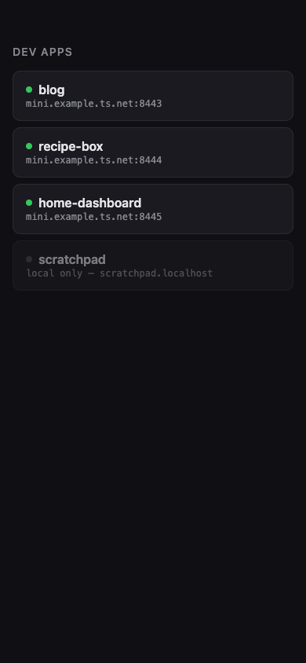

# portless-home

A tiny home page for your tailnet: open `https://<device>.<tailnet>.ts.net`
on your phone and see every dev app currently running through
[portless](https://github.com/vercel-labs/portless), as tappable links.



Rendered from the example fixture (`docs/fixtures/routes.example.json`):
fake app names and `example.ts.net`, not a real tailnet.

## Why

Portless's `--tailscale` mode shares each app on its own port of your
device's MagicDNS name (`:443`, `:8443`, `:8444`, …), assigned by start
order — so from another device you never know which port an app got.
portless-home claims `:443` with a directory page instead:

- the bare device URL always shows the list, auto-refreshing every 15s
- apps land predictably on `:8443`, `:8444`, …
- each card has a health dot: green if the app answers a local probe
  (HEAD request, 300ms timeout, all cards probed in parallel), grey if
  not
- apps running without Tailscale sharing show up greyed out as "local
  only"

It's one dependency-free Node server (`server.mjs`, ~90 lines) reading
portless's own `~/.portless/routes.json` on every request. Nothing to
configure, nothing to restart when apps come and go. It listens on
`127.0.0.1` and is only reachable from your own tailnet (and localhost)
through `tailscale serve`. No data leaves your machine.

## Requirements

- Node.js
- macOS or Linux
- [portless](https://github.com/vercel-labs/portless) with Tailscale sharing
  (`--tailscale` or `PORTLESS_TAILSCALE=1`)
- Tailscale connected, with MagicDNS + HTTPS Certificates enabled in your
  tailnet's DNS settings

## Install

```sh
git clone https://github.com/xkeanu/portless-home
cd portless-home
./install.sh
```

This copies the server to `~/.portless-home/`, registers a login service
(launchd `sh.portless.home` on macOS, a systemd user service on Linux;
starts at login, restarts on crash, no sudo), and adds a persistent
`tailscale serve` rule pinning it to `:443`.

Custom port: `PORT=6001 ./install.sh` (then the serve rule targets that
port).

## Uninstall

```sh
./uninstall.sh
```

Removes the login service, the installed files, and the `:443` serve
rule.

## How it fits together

```
phone ── https://<device>.<tailnet>.ts.net ──► tailscale serve :443 ──► portless-home :5995
                                       :8443 ──► your app A
                                       :8444 ──► your app B
```

portless-home never proxies app traffic; it only renders links. Each
app's traffic goes through Tailscale's own serve rules, with Tailscale's
certs.

## Running it locally

Serve the directory page from any `routes.json`, real or fake, without
installing anything:

```sh
PORTLESS_ROUTES=docs/fixtures/routes.example.json PORT=5995 node server.mjs
```

Then open `http://127.0.0.1:5995`. The default port is `5995`, outside
portless's own `4000-4999` app range; override with `PORT`.

Tests:

```sh
node --test
```
