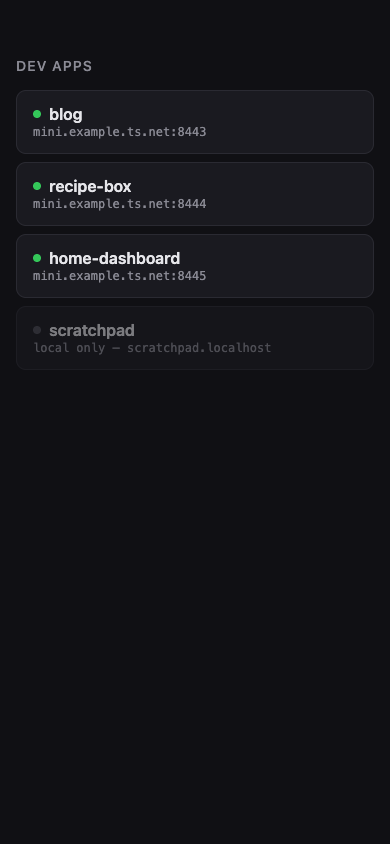

# portless-home

A tiny home page for your tailnet: open `https://<device>.<tailnet>.ts.net`
on your phone and see every dev app currently running through
[portless](https://github.com/vercel-labs/portless), as tappable links.



Rendered from the example fixture (`docs/fixtures/routes.example.json`):
fake app names and `example.ts.net`, not a real tailnet.

## Why

Portless's `--tailscale` mode shares each app on its own port of your
device's MagicDNS name (`:443`, `:8443`, `:8444`, …), assigned by start
order — so from another device you never know which port an app got.
portless-home claims `:443` with a directory page instead:

- the bare device URL always shows the list, updating the moment an app
  starts or stops (server-sent events; a 15s refresh if the stream fails)
- apps land predictably on `:8443`, `:8444`, …
- each card has a health dot: green if the app answers a local probe
  (HEAD request, 300ms timeout, all cards probed in parallel), grey if
  not
- apps running without Tailscale sharing show up greyed out as "local
  only"
- a banner warns when Tailscale itself is down (tailnet links would be
  dead) with the command to reconnect
- optionally, apps from your other machines too, grouped under one
  heading per device (see [Other devices](#other-devices))
- the page's few labels follow your browser's language (English,
  German, Spanish, French, Portuguese, Japanese), picked from the
  `Accept-Language` header

It's a tiny dependency-free Node server (`server.mjs`, plus `render.mjs`
for the HTML, `i18n.mjs` for its labels, `peers.mjs` for talking to
other instances and `live.mjs` for the change stream) reading portless's
own `~/.portless/routes.json` on every request. Nothing to configure,
nothing to restart when apps come and go. It listens on `127.0.0.1` and
is reachable through `tailscale serve` according to your tailnet's access
policy, including users you explicitly share the host with, and on localhost.
Nothing is sent to any third-party service.

## Requirements

- Node.js 20.6 or newer to run an installed package
- Node.js 22.12 or newer to build from a checkout
- macOS, Linux, or Windows
- [portless](https://github.com/vercel-labs/portless) with Tailscale sharing
  (`--tailscale` or `PORTLESS_TAILSCALE=1`)
- Tailscale connected, with MagicDNS + HTTPS Certificates enabled in your
  tailnet's DNS settings

## Install

### Prebuilt release

Tagged archives already contain the UI and run with Node alone. Download the
archive for the tag you want, verify its `*.sha256` file, then install it:

```sh
curl -LO https://github.com/xkeanu/portless-home/releases/download/vX.Y.Z/portless-home-vX.Y.Z.tar.gz
curl -LO https://github.com/xkeanu/portless-home/releases/download/vX.Y.Z/portless-home-vX.Y.Z.sha256
grep '  portless-home-vX.Y.Z.tar.gz$' portless-home-vX.Y.Z.sha256 | shasum -a 256 -c -
tar -xzf portless-home-vX.Y.Z.tar.gz
cd portless-home-vX.Y.Z
./install.sh
```

### Build from source

Use a checkout when working on the project or tracking HEAD:

```sh
git clone https://github.com/xkeanu/portless-home
cd portless-home
npm ci
npm run build
./install.sh
```

The install scripts check for the built files before they create a directory,
replace a login service, or change Tailscale. Tagged archives already contain
those files and need Node only at runtime.

Either path copies the server to `~/.portless-home/`, registers a login service
(launchd `sh.portless.home` on macOS, a systemd user service on Linux;
starts at login, restarts on crash, no sudo), and adds a persistent
`tailscale serve` rule pinning it to `:443`. If Tailscale isn't running
at install time, the script skips the serve rule and prints the command
to run once it's up.

Custom port: `PORT=6001 ./install.sh` (then the serve rule targets that
port).

Don't want it starting at login? `./install.sh --no-autostart` starts
the server now but skips start-at-login (and crash restarts). Rerun
`./install.sh` without the flag to switch back.

### Windows

For a tagged archive:

```powershell
Invoke-WebRequest https://github.com/xkeanu/portless-home/releases/download/vX.Y.Z/portless-home-vX.Y.Z.zip -OutFile portless-home-vX.Y.Z.zip
Invoke-WebRequest https://github.com/xkeanu/portless-home/releases/download/vX.Y.Z/portless-home-vX.Y.Z.sha256 -OutFile portless-home-vX.Y.Z.sha256
$expected = ((Get-Content portless-home-vX.Y.Z.sha256 | Where-Object { $_ -match '\.zip$' }).Split())[0]
if ((Get-FileHash portless-home-vX.Y.Z.zip -Algorithm SHA256).Hash.ToLower() -ne $expected) { throw 'Checksum mismatch' }
Expand-Archive portless-home-vX.Y.Z.zip
Set-Location portless-home-vX.Y.Z
powershell -ExecutionPolicy Bypass -File .\install.ps1
```

To build from source instead:

```powershell
git clone https://github.com/xkeanu/portless-home
cd portless-home
npm ci
npm run build
powershell -ExecutionPolicy Bypass -File .\install.ps1
```

Same result, Windows-style: the server goes to `%USERPROFILE%\.portless-home\`
and runs as a per-user scheduled task named `portless-home` (starts at
login, restarts on crash, no console window, no admin), and the same
`tailscale serve` rule pins it to `:443`. The task starts `node` directly
with the config in `service.env` next to it (port and file paths), which
is also where to look if you change the port later. `$env:PORT = 6001`
before running the script picks the port; `-NoAutostart` is
`--no-autostart`. The Tailscale CLI is found on `PATH` or in
`%ProgramFiles%\Tailscale`.

### Homebrew

The formula deliberately installs from HEAD and builds the locked contributor
dependencies. It does not use release archives:

```sh
brew tap xkeanu/portless-home https://github.com/xkeanu/portless-home
brew install --HEAD xkeanu/portless-home/portless-home
```

Then pick how it runs — this is the start-at-login switch for the brew
path:

```sh
brew services start portless-home   # run now and at every login
brew services run portless-home     # run now only
brew services stop portless-home    # off
```

Homebrew doesn't touch your Tailscale config, so add the serve rule
yourself (once; it persists across reboots):

```sh
tailscale serve --bg --https=443 http://127.0.0.1:5995
```

## Start registered apps locally

To keep stopped apps on the page, create `~/.portless-home/apps.json`
with explicit opt-in and commands you trust:

```json
{
  "enabled": true,
  "apps": [
    {
      "hostname": "demo.localhost",
      "cwd": "/absolute/path/to/demo",
      "command": "portless demo npm run dev"
    }
  ]
}
```

On Windows, use an absolute path such as `C:\\Users\\you\\code\\demo`.
`PORTLESS_APPS` overrides the registry path. Changes take effect on the
next page load, without restarting the server. Missing, disabled, or
invalid configuration turns off the launcher. Hostnames must be unique
and match the app's Portless route.

Open `http://127.0.0.1:5995` or `http://localhost:5995` on the server's
machine. Stopped entries have a **Start** button. The page disables it
while the command runs and switches to the running route when Portless
registers it. A failed command shows an error and allows another attempt.
For details, run the configured command in a terminal; this launcher
does not capture logs. If you edit the registry while viewing the page,
reload to see the change.

Commands run through the operating system's shell, as the server's user,
with the server's environment and the configured working directory.
Use foreground commands, without `&`, daemonization, or interactive
prompts. Login services may have a different `PATH` from your terminal;
use absolute executable paths when needed. Starting an app never accepts
a command or working directory from the browser.

The launcher accepts only direct loopback requests with matching local
Host and Origin headers. Proxy and cross-site requests are rejected.
Start controls and stopped entries are absent from tailnet pages and
peer APIs. This is a local-machine boundary, not authentication between
local users: other programs on the machine can submit local requests.
Protect the registry as carefully as your shell scripts. On macOS and
Linux, its file must belong to the server's user and must not be writable
by group or other users (`chmod 600 ~/.portless-home/apps.json`). On
Windows, use file permissions that allow only your account to edit it.

Duplicate starts are rejected while this server tracks the launched
process, or while a live route with that hostname exists. Started apps
can outlive the directory server. If you restart the directory during
startup, wait for the app's route before trying again. There are no stop
controls, automatic starts, or restart policies. Delete the registry or
set `enabled` to `false` to disable future launches; this does not stop
apps already started.

## Menu bar (macOS)

Two options: a native app, or a plugin for xbar/SwiftBar if you already
run one of those. Both show the same menu.

### Native app

`macos/` is a small AppKit app (SwiftPM, no Xcode project). It puts the
portless-home icon in the menu bar with the number of apps passing the
health probe, and a dropdown listing every running app — ● / ○ health
dot, click to open its tailnet URL (local-only apps are listed greyed
out) — plus **Open home page**, **Start / Stop / Restart service** for
the login service, and a **Launch at login** toggle. It refreshes every
15s and whenever you open the menu; when the server is down the icon
greys out and the menu offers **Start service**. It lives in
`~/Applications`, so Spotlight finds it.

Install with Homebrew (compiles on your machine with the Xcode Command
Line Tools, so no Gatekeeper prompt; macOS 13+):

```sh
brew install --HEAD xkeanu/portless-home/portless-home-app
mkdir -p ~/Applications && ln -sf "$(brew --prefix)/opt/portless-home-app/PortlessHome.app" ~/Applications/
```

Or build it from a checkout: `macos/build.sh` writes
`macos/dist/PortlessHome.app`; move that into `~/Applications`. Tests:
`cd macos && swift test`.

The app only talks to the local server (`/api/routes`); the port is read
from the installed launchd plist, `PORTLESS_HOME_URL` overrides the
server URL.

### xbar / SwiftBar plugin

`menubar/portless-home.15s.sh` is a plugin for [xbar](https://xbarapp.com)
or [SwiftBar](https://swiftbar.app). It puts `⌂ 3` in the menu bar (the
number of apps passing the health probe) with a dropdown listing every
running app — a ● / ○ health dot and a link to its tailnet URL (local-only
apps link to their localhost port) — plus **Open home page** and
**Start / Stop / Restart service** for the login service. Copy or symlink
it into your plugin folder:

```sh
ln -s "$PWD/menubar/portless-home.15s.sh" ~/Library/Application\ Support/xbar/plugins/
```

(For SwiftBar, use the plugin folder you chose in its settings. Installed
via Homebrew? The file is at
`$(brew --prefix)/share/portless-home/menubar/portless-home.15s.sh`.) The
`15s` in the file name is the refresh interval; rename the link to change
it.
When the server is down the icon greys out and the menu offers **Start
service**. The plugin only needs `curl`: the menu itself comes from the
server at `/api/menubar`, in the plugin text format, and the port is read
from the installed launchd plist (`PORTLESS_HOME_URL` overrides the
server URL).

## System tray (Windows)

`tray/portless-home-tray.ps1` is the same menu as a tray icon: a house,
green when the server is up (hover for the healthy-app count) and grey
when it's down. Right-click for the running apps with their health dots
and tailnet links, **Open home page**, **Start / Stop / Restart service**
for the scheduled task, and **Exit**. It needs nothing but Windows
PowerShell; the menu comes from the server at `/api/menubar` just like
the macOS plugin, and the port is read from `service.env`
(`PORTLESS_HOME_URL` overrides the server URL). Start it without a
window:

```powershell
powershell -WindowStyle Hidden -ExecutionPolicy Bypass -File tray\portless-home-tray.ps1
```

To have it back at every login, put a shortcut to that command in the
Startup folder (Win+R, `shell:startup`).

## Other devices

Running portless-home on more than one machine? Any instance can show
the others' apps as well. List their device URLs in
`~/.portless-home/peers.json`:

```json
{ "peers": ["https://laptop.example.ts.net", "https://desktop.example.ts.net"] }
```

No restart needed — the file is read on every request. Once at least
one peer is listed, the page groups apps under a heading per device,
this machine first. Each peer is asked for its list over the tailnet
(hard 1.5s timeout, in parallel with the local health checks); a peer
that's off or unreachable is dropped after at most 1.5s and simply
doesn't appear. Redirects from a peer aren't followed. Peer cards are
read-only: renames and pins stay on the device they were made on.

Every instance serves its own list as JSON at `/api/routes`:

```json
{ "device": "laptop", "apps": [
  { "hostname": "web.localhost", "label": "Web", "tailscaleUrl": "https://laptop.example.ts.net:8443", "up": true },
  { "hostname": "scratch.localhost", "label": "scratch", "up": false }
] }
```

`label` is the display name (after any rename), `up` is the health
probe result, and `tailscaleUrl` is absent for local-only apps. The
endpoint only ever lists the device it runs on, so two instances
listing each other can't loop. `PORTLESS_PEERS` points the server at a
different peers file.

For access across tailnets or outside Tailscale, see the
[sharing research](docs/tailnet-sharing.md). The directory does not filter
entries by viewer: anyone with access can see the peer summaries the server
fetches, even when they cannot open those apps themselves.

## Uninstall

```sh
./uninstall.sh
```

Removes the login service, the installed files, and the `:443` serve
rule. On Windows: `powershell -ExecutionPolicy Bypass -File .\uninstall.ps1`.

## How it fits together

```text
phone ── https://<device>.<tailnet>.ts.net ──► tailscale serve :443 ──► portless-home :5995
                                       :8443 ──► your app A
                                       :8444 ──► your app B
```

portless-home never proxies app traffic; it only renders links. Each
app's traffic goes through Tailscale's own serve rules, with Tailscale's
certs.

## Running it locally

Run the server straight from a built checkout, no install needed. It reads
`~/.portless/routes.json` by default and serves `http://127.0.0.1:5995`:

```sh
npm ci
npm run build
node server.mjs
```

`PORTLESS_ROUTES` points it at any other routes file. The server hides
entries whose `pid` isn't a live process, so to preview the bundled
fixture (the one the screenshot above is rendered from), stamp its
entries with a live pid first:

```sh
node -e 'const fs=require("fs"),r=JSON.parse(fs.readFileSync("docs/fixtures/routes.example.json","utf8"));fs.writeFileSync("/tmp/routes.json",JSON.stringify(r.map(x=>({...x,pid:+process.argv[1]}))))' $$
PORTLESS_ROUTES=/tmp/routes.json node server.mjs
```

The default port is `5995`, outside portless's own `4000-4999` app
range; override with `PORT`.

Tests:

```sh
npm test
```

## Releases

Tagged releases include `dist/ui-server.mjs`, `dist/ui.js`, and
`dist/ui.css`. The server exposes the browser files at `/assets/ui.js` and
`/assets/ui.css`, so running the package needs no npm install and no build.
The Homebrew formula remains a HEAD source build.

Maintainers create candidate archives after a clean build:

```sh
node scripts/package.mjs v1.2.3 --output release
node scripts/release-smoke.mjs release/portless-home-v1.2.3.tar.gz
```

The command writes deterministic `.tar.gz` and `.zip` archives plus a
`*.sha256` file. It copies an explicit release manifest, including the
installers, built UI, runtime source, and referenced docs, and excludes
`node_modules`. It uses the system `tar` and `zip` tools because Node does
not provide archive writers. The manifest order, file timestamps, archive
ownership, gzip timestamp, and stripped zip metadata keep repeated builds on
the release runner reproducible.

Signed and notarized macOS binaries and a Homebrew cask are tracked separately
in #34. They are not part of these Node release archives.
